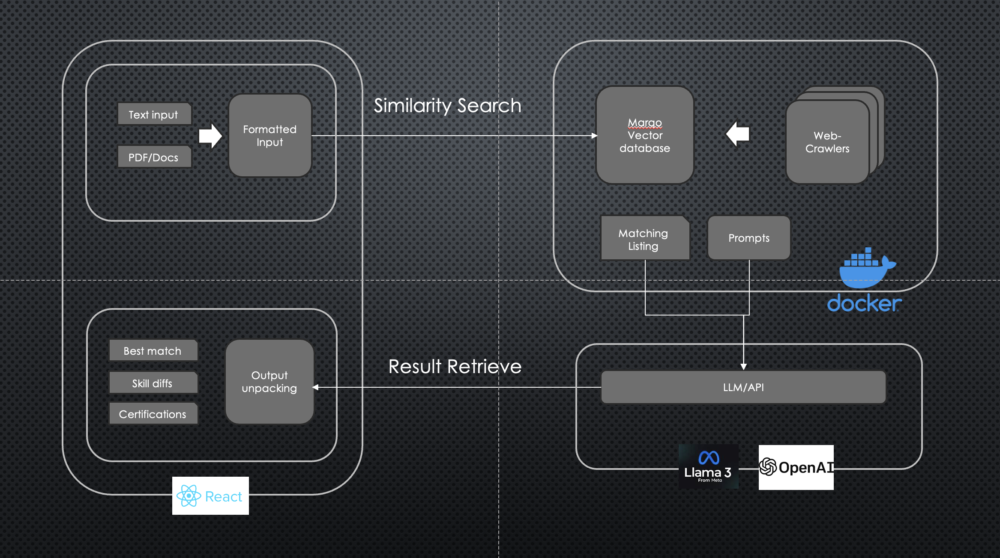

# Job Analyzer LLM

## Description
* 
This project aims to provide a tool/service for job seekers:

Given the job seekers' experience/skills, the tool will conduct a vector search on the job postings and find the most relevant job postings. Also, the tool will analyze the job postings and provide suggestions to help the job seekers to better prepare for the job application.

We aim to solve a few user pain points:
- Among the job postings, it is hard to the best match based on title search.
- Requirements/qualifications are sometime vague and hard to understand.
- Preparing of application materials is time-consuming and hard to tailor to the job postings.

## User Stories
1. As a job seeker looking for software engineer positions, I want to find the most relevant job postings based on my experience/skills, so that I can focus on the most relevant job postings. However, searching for "software engineer" on job sites returns a lot of irrelevant job postings, narrowing down to "front-end software engineer" is still not enough. If i add "React" to the search, I may miss some job postings that require React but not in the title.
2. As a job seeker looking for software engineer positions, I am looking at a job posting that requires "Backend experience with Python". I do have experience with Python but not in the backend. I want to know should I apply for this job and what I need to prepare for the application. 

## High Level Design

## Key Components
* Front-end: Web UI
  > * Guide the user to input their experience/skills.
  > * Display the most relevant job postings.
  > * Display the job posting analysis.

* Database: Marqo Vector Database
  > * Store the job postings.
  > * Index the job postings' description for search.

* Back-end: RESTful API
  > * Handle the user input.
  > * Call the job posting API to fetch & update job postings.
  > * Call the database to search for the most relevant job postings.
  > * Call the LLM API to analyze the job postings.
  > * Return the results to the front-end.

* Web-crawler: Crawl job postings from job sites periodically.
  > * Crawl job postings from job sites.
  > * Update the job postings in the database.

* LLM API: Configurable LLM model and API
  > * Using OpenAI API along with fetched job postings to analyze the job postings.
  > * Or train a custom LLM model with the job postings. Currently exploring the feasibility with LLaMa 3.

## DISCLAIMER:

The initial version of this project is rely on a job listing dataset that is provided by kaggle.com(https://www.kaggle.com/datasets/arshkon/linkedin-job-postings). The dataset is a collection of job listings from LinkedIn. The dataset is not complete and is not up-to-date. The dataset is used for the purpose of testing the project. The dataset is not used for commercial purpose.

